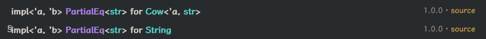
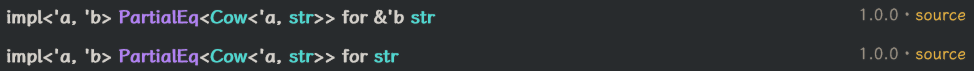

## The issue

Yesterday when I was coding, I wrote something like this:

```rust
// s: &Arc<str>;
assert_eq!(s, "example");
```

This actually fails to compile:

```stderr
   Compiling playground v0.0.1 (/playground)
error[E0277]: can't compare `Arc<str>` with `str`
 --> src/main.rs:7:5
  |
7 |     assert_eq!(example, "example");
  |     ^^^^^^^^^^^^^^^^^^^^^^^^^^^^^^ no implementation for `Arc<str> == str`
  |
  = help: the trait `PartialEq<str>` is not implemented for `Arc<str>`, which is required by `&Arc<str>: PartialEq<&str>`
  = note: required for `&Arc<str>` to implement `PartialEq<&str>`
  = note: this error originates in the macro `assert_eq` (in Nightly builds, run with -Z macro-backtrace for more info)
help: consider dereferencing both sides of the expression
 --> /playground/.rustup/toolchains/stable-x86_64-unknown-linux-gnu/lib/rustlib/src/rust/library/core/src/macros/mod.rs:46:22
  |
46|                 if !(***left_val == **right_val) {
  |                      ++             +

For more information about this error, try `rustc --explain E0277`.
error: could not compile `playground` (bin "playground") due to 1 previous error
```

The compiler is not smart enough, we should do this instead:

```rust
assert_eq!(& * *s, "example");
//         ││└ &Arc<str> deref to Arc<str>
//         │└ Arc<str> deref to str (smart pointer)
//         └ &str
```

Emmm, it's a bit ugly, however.

## Dive deeper

Here's [`PartialEq`](https://doc.rust-lang.org/std/cmp/trait.PartialEq.html):

```rust
pub trait PartialEq<Rhs = Self>
where
    Rhs: ?Sized,
{
    // Required method
    fn eq(&self, other: &Rhs) -> bool;

    // Provided method
    fn ne(&self, other: &Rhs) -> bool { ... }
}
```

We can just find these impls within the std:






So, unlike `Cow<'a, str>` or `String`, &`Arc<str>` can be compared with other &`Arc<str>`, but not with other &`str`.

I wonder why the std doesn't provide such impls.
